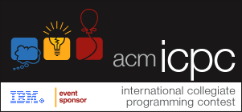

# ICPC与CCPC

## ICPC官方简介

ACM 国际大学生程序设计竞赛 (ACM/ICPC 或 ICPC) 是由美国计算机协会 (ACM) 主办的，一项旨在展示大学生创新能力、团队精神和在压力下编写程序、分析和解决问题能力的年度竞赛。经过近 30 多年的发展，ACM 国际大学生程序设计竞赛已经发展成为最具影响力的大学生计算机竞赛。赛事目前由 IBM 公司赞助。

### 历史

竞赛的历史可以上溯到 1970 年，当时在美国德克萨斯 A&M 大学举办了首届比赛。当时的主办方是 the Alpha Chapter of the UPE Computer Science Honor Society。作为一种全新的发现和培养计算机科学顶尖学生的方式，竞赛很快得到美国和加拿大各大学的积极响应。1977 年，在 ACM 计算机科学会议期间举办了首次总决赛，并演变成为目前的一年一届的多国参与的国际性比赛。

最初几届比赛的参赛队伍主要来自美国和加拿大，后来逐渐发展成为一项世界范围内的竞赛。特别是自 1997 年 IBM 开始赞助赛事之后，赛事规模增长迅速。1997 年，总共有来自 560 所大学的 840 支队伍参加比赛。而到了 2004 年，这一数字迅速增加到 840 所大学的 4109 支队伍并以每年 10-20% 的速度在增长。

1980年代，ACM 将竞赛的总部设在位于美国德克萨斯州的贝勒大学。

在赛事的早期，冠军多为美国和加拿大的大学获得。而进入 1990 年代后期以来， 俄罗斯和其它一些东欧国家的大学连夺数次冠军。来自中国大陆的上海交通大学代表队则在 2002 年美国夏威夷第 26 届、 2005 年上海举行的第 29 届以及2010年哈尔滨举行的第34届全球总决赛上三夺冠军。这也是目前为止亚洲大学在该竞赛上取得的最好成绩。赛事的竞争格局已经由最初的北美大学一枝独秀演变成目前的亚欧对抗的局面。2011年浙江大学也获得了ACM全球总冠军。

### 简要规则

ACM/ICPC 以团队的形式代表各学校参赛，每队由 3 名队员组成。每位队员必须是入校 5 年内的在校学生，最多可以参加 2 次全球总决赛和 5 次区域选拔赛。

比赛期间，每队使用 1 台电脑需要在 5 个小时内使用 C、C++、Pascal 或 Java 中的一种编写程序解决 6 至 10 个问题。程序完成之后提交裁判运行，运行的结果会判定为正确或错误两种并及时通知参赛队。而且有趣的是每队在正确完成一题后，组织者将在其位置上升起一只代表该题颜色的气球。

最后的获胜者为正确解答题目最多且总用时最少的队伍。每道试题用时将从竞赛开始到试题解答被判定为正确为止，其间每一次提交运行结果被判错误的话将被加罚 20 分钟时间，未正确解答的试题不记时。例如：A、B 两队都正确完成两道题目，其中 A 队提交这两题的时间分别是比赛开始后 1:00 和 2:45，B 队为 1:20 和 2:00，但 B 队有一题提交了 2 次。这样 A 队的总用时为 1:00+2:45=3:45 而 B 队为 1:20+2:00+0:20=3:40，所以 B 队以总用时少而获胜。

### 区域和全球决赛

与其它计算机程序竞赛（例如国际信息学奥林匹克，IOI）相比，ACM/ICPC 的特点在于其题量大，每队需要 5 小时内完成 8 道题目，甚至更多。另外一支队伍 3 名队员却只有 1 台电脑，使得时间显得更为紧张。因此除了扎实的专业水平，良好的团队协作和心理素质同样是获胜的关键。

赛事由各大洲区域预赛和全球总决赛两个阶段组成。各预赛区第一名自动获得参加全球总决赛的资格。决赛安排在每年的 3-4 月举行，而区域预赛一般安排在上一年的 9-12 月举行。一个大学可以有多支队伍参加区域预赛，但只能有一支队伍参加全球总决赛。
全球总决赛第一名将获得奖杯一座。另外，成绩靠前的参赛队伍也将获得金、银和铜牌。而解题数在中等以下的队伍会得到确认但不会进行排名。

## CCPC官方简介

中国大学生程序设计竞赛（China Collegiate Programming Contest， 简称CCPC）是由中国大学生程序设计竞赛协会主办的面向世界大学生的国际性年度赛事，旨在激励当代大学生运用计算机编程技术和技能来解决实际问题，激发其学习算法和程序设计的兴趣，培养其团队合作意识、创新能力和挑战精神。

中国大学生程序设计竞赛协会是由中国各高校程序设计竞赛教练组成的社会团体，于2014年筹备成立。协会常务理事会成员具有丰富的赛事组织和指导经验，很多人从1996年开始就担任教练和赛事组织工作，不仅指导学生在程序设计竞赛中多次获得全球总冠军以及数十枚金银铜奖，而且都有承办全球或亚洲地区程序设计国际比赛的成功经历。

CCPC竞赛规则类似ICPC。

## 八卦
