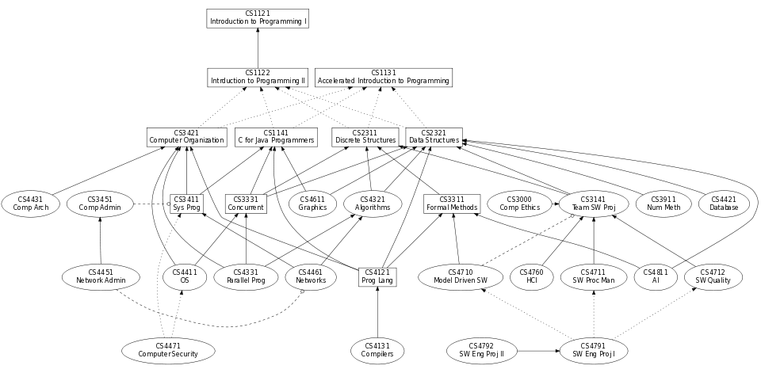

# 为什么参加竞赛？

## 竞赛的意义

### 通向计算机科学之路

程序设计竞赛的唯一目标就是解决问题：找一个独特的角度分析问题，经过推导和变换把毫无头绪的问题(有时候甚至是来自实际中的问题)的解决思路变得明朗，最后用高效的方式编程解决。

解决那些难题本来就是很酷的事情不是吗？

不止。竞赛给了我们激励，一个原始的动机去把一切事情做得更好，这也是其魅力所在——参加竞赛就意味着无止境的超越自己的过程，编码在我们基因里所向往的过程。

> (不解风情的解读) 由于竞赛有明确的目标(在规定的时间内解出更多的题目)，因此更能使人在训练的过程中得到正向的反馈，从而产生更多的激励和兴趣。同时与体育竞赛不同，智力竞赛不仅需要强化训练，还需要大幅、系统性地补充一个广阔科学领域内的知识，在知识体系日趋完备时，又同时能增加竞赛内外的问题解决能力，从而进入一个良性的循环。因此，很多参加过竞赛之后活跃在工业界/学术界的人都将竞赛经历视为爱上计算机科学的理由。(好吧我编不下去了，请精通心理学的同学帮我补完……)

于是你学习如何将具体的问题抽象成模型，并熟练地用正确的算法解决他们。你学习如何为问题设计算法、如何分析算法、如何将合适的算法变成代码实现。这个过程甚至每天都在我们的生活中被使用——如何根据传感器的读数计算步数？如何为外卖小哥规划最佳的投递路线？如何为一次竞赛安排座位？如何规划导航的路线？

> 会编程的你可以试试，怎样把这些实际生活中的问题变成算法问题并解决。例如，我们用[CNF-SAT](https://en.wikipedia.org/wiki/Boolean_satisfiability_problem)建模满足条件的竞赛座位安排。在Uber，为了解决拼车路线的计算，每天都会求解海量次数的[TSP](https://en.wikipedia.org/wiki/Travelling_salesman_problem)问题。而这些困难问题的复杂解法是由许多“基本”的问题求解技术组合而成的。

这个过程也包含在各种不那么显然的问题里：如何训练机器的“棋感”来击败最强的棋手？如何让机器理解语音并做出反馈？如何证明程序的性质？如何在海量数据中检索？这些技术的诞生也依赖问题求解的技能(当然少不了领域专家多年研究的沉淀)，但它们发现的过程与竞赛解题的过程是惊人的相似。

> 这些前沿科技并不是凭空诞生的，如果顺着研究工作发展的历程追本溯源，你会发现这些最新的技术最终都被分解为了一个个基本的问题。例如击败李世石九段的AlphaGo就结合了蒙特卡洛树搜索、卷积神经网络和强化学习，更多信息可以参考这一批篇[解读](https://zhuanlan.zhihu.com/p/20647792)。

“问题求解”的技术不断刷新人类对计算机能力认识的极限。

你从竞赛中学到的知识和技术，学到的决不放弃的精神，学到的队伍配合的方法，都是你走在计算机科学道路上宝贵的财富。从逻辑门到完整的计算机系统栈；从海量数据处理到人工智能；从物联网到火箭升空，算法和编程永远是打破极限、改变世界的利刃。

**正如“更快、更高、更强”的奥林匹克格言激励人们不断进取、永不满足地奋斗和不畏艰险、敢攀高峰地拼搏，程序设计竞赛也激励了一代一代的计算机科学与工程工作者实现技术的价值。参加竞赛的意义不仅是证明自己，更是对炉火纯青技艺的追求和改变世界的梦想的渴望。**

### 陷阱与缺陷

为什么有陷阱和缺陷？先谈谈为什么需要高考。

无论社会对高考做怎样的解读，考试的意义本都是检查学生对知识体系的掌握程度，以成绩和奖励来鞭策考生刻苦学习，从而达到甄别优秀学生的目的。因此，“正确”的参加高考方式应当是对各个学科的基本动机、原理与技术融会贯通地理解，然后经过少量的热身性质的训练参加考试，考试分数基本正比于学生对学科理解的深刻程度。

竞赛也一样。

编程竞赛的本意是培养敏锐的解决算法问题的直觉，以及精通编程技巧、算法设计分析技术和技巧，从而为今后的科学研究或工程实践打一个良好的基础。“正确”的参加竞赛方式是对计算机科学有一定的认识后，在对问题求解有极高兴趣的人群中进行问题求解和编程的强化训练，从而获得各方面的奖励和激励(提高编程和解决问题的能力、做好参与科学研究的准备、取得成绩、在求职中处于优势……)。

回到高考的意义。事与愿违的是，为了平衡所有考生的分数分布，高考题的模式太过固定，使得高考成绩可以通过反复做题(而不怎么需要理解背后的原理，甚至教师也不理解背后的原理)的强化训练得到成绩最大化(即收益最大化)，相当于机器学习过程中的[过拟合(overfitting)](https://en.wikipedia.org/wiki/Overfitting)，偏离了考试的初衷。

竞赛中也充满同样的陷阱。

与体育竞技一样，在竞赛中取得好成绩一方面在于天赋(以及在计算机学科中的训练)，另一方面几乎离不开高强度和正确的训练。训练带来的奖励(题目通过、获得赞赏、取得奖项……)有如此大的吸引力，以至于相当多的选手在相当长的一段时间里沉浸其中不能自拔，而忽略了竞赛的意义。

我们不希望任何一个参加竞赛的同学偏离正轨。也是我们维护这个项目的初衷——竞赛是一个初始的动机、一生的爱好、结识朋友的契机，但不是唯一的目的。**我们希望通过一个与传统教学体系不同的路线，为有兴趣的同学打开通往更广阔的空间——计算机科学之路——的大门。**

## 竞赛与计算机科学之路

从计算机科学的知识体系看，主要包含两大主线：理论(theory)和系统(system)。计算理论研究计算机的能力和极限，回答“什么是计算”的问题；计算机系统研究如何构造真实的计算机系统以解决实际中的问题，回答“如何构造计算机(硬件/软件/应用)”。例如下面是一个计算机方向本科课程的关系图(转载自[此处](http://www.cs.mtu.edu/gifs/img18.html))。

虽然程序设计竞赛偏重理论方面，它和体系中的许多课程都有或多或少的交集。对理论方面的入门课程，竞赛中涉及的内容都比教科书深入得多(离散数学/算法/数据结构／数值分析等)，而且同时强调对技术的掌握和解题的技巧(很多竞赛题的解法都来自于理论计算机科学中的研究成果)。也有相当多的课程在接受过竞赛训练后会变得轻而易举，例如图形学中所用的基本技术就在竞赛中频繁出现。另外也有很多看起来与竞赛“不相关”，尤其是系统方面的课程(例如进阶级的计算机体系结构/操作系统课程)，也能增加你在竞赛中的经验和能使用的技巧(例如代码优化的技巧、系统相关的hack)。

所以说，学好课程和做好竞赛之间完全没有矛盾，甚至是个不错的提升专业素养的业余爱好。

更值得注意的是，编程竞赛关注的是各种问题中的一个很特定的子集：限定于能在短时间内得到精确求解的一些问题，其中大部分存在多项式时间算法。而这恰恰是我们能解决的绝大部分问题——即便是那些复杂的NP-难问题，我们也总是提出多项式时间的近似或启发式算法。在竞赛中训练得到的这种解题能力将帮助你更好地解决实际中的难题和挑战。

### 编程竞赛与科学研究

### 编程竞赛与计算机工程

